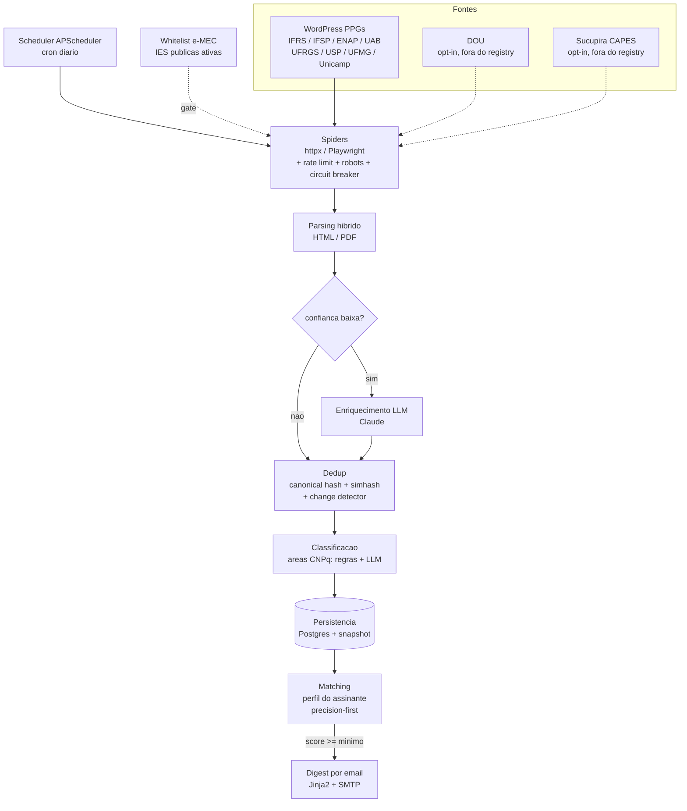

<div align="center">


[](https://github.com/fabricioguidine/pos-editais-monitor/actions/workflows/ci.yml) [](LICENSE) [](https://www.python.org) [](https://github.com/astral-sh/ruff) [](https://www.docker.com)

</div>

> Monitoramento automatizado, respeitoso e auditavel de editais de pos-graduacao **gratuitos** no Brasil.

Pipeline ETL especializado em editais que **descobre, normaliza, deduplica, classifica, filtra e notifica** sobre chamadas de pos-graduacao gratuitas (especializacao, MBA, mestrado, doutorado, EAD/UAB). A informacao existe, mas esta fragmentada em centenas de portais com layouts diferentes, muitas vezes apenas em PDF e sem feed RSS. A saida e um **digest diario por email**, enviado **apenas quando ha matches** contra o perfil academico do assinante. Sem notificacao de ruido.

## Sumario

- [Funcionalidades](#funcionalidades)
- [Arquitetura](#arquitetura)
- [Como funciona](#como-funciona)
- [Fontes monitoradas](#fontes-monitoradas)
- [Matching personalizado](#matching-personalizado)
- [Postura etica de scraping](#postura-etica-de-scraping)
- [Stack](#stack)
- [Requisitos](#requisitos)
- [Rodando localmente](#rodando-localmente)
- [Configuracao](#configuracao)
- [Observabilidade](#observabilidade)
- [Estrutura do projeto](#estrutura-do-projeto)
- [Roadmap](#roadmap)
- [Documentacao adicional](#documentacao-adicional)
- [Licenca](#licenca)

## Funcionalidades

- **Descoberta multi-fonte** via spiders por portal (WordPress de PPGs, UAB, IFs, universidades), com clientes httpx e Playwright.
- **Parsing hibrido** HTML/PDF com estrategias por tipo de fonte e **fallback LLM (Claude)** quando a confianca extraida e baixa.
- **Deduplicacao** por hash canonico + simhash + change detector entre snapshots.
- **Classificacao** por areas CNPq combinando regras e LLM (hibrida).
- **Whitelist e-MEC** como gate: so processa editais de IES publicas ativas e credenciadas.
- **Matching precision-first** baseado no perfil do assinante (hard filters + soft scoring).
- **Digest diario por email** (Jinja2 + SMTP) com canal Telegram opcional.
- **API FastAPI** para consulta de editais e healthcheck.
- **CLI** `pem` para scrape ad-hoc, worker, seed e dispatch manual do digest.
- **Observabilidade** com logs estruturados (structlog), traces OpenTelemetry e metricas Prometheus.

## Arquitetura

Aplicacao organizada em **camadas** seguindo principios de **Clean Architecture / Hexagonal**. O fluxo de ponta a ponta:



Veja [`docs/ARCHITECTURE.md`](docs/ARCHITECTURE.md) para o detalhamento de cada camada, fluxos de dados e as decisoes registradas em [`docs/adr/`](docs/adr/).

## Como funciona

1. O **scheduler** (APScheduler, cron diario) dispara os spiders registrados.
2. Cada **spider** descobre URLs e faz fetch via httpx (estatico) ou Playwright (JS-heavy), passando por rate limiter, verificacao de `robots.txt` e circuit breaker.
3. O **parser** apropriado extrai os campos do edital (HTML/PDF). Se a confianca ficar abaixo do limiar, entra o **enriquecimento por LLM** (Claude).
4. O edital passa por **dedup** (hash canonico, simhash, change detector), e e **classificado** por area CNPq (regras + LLM).
5. O resultado e **persistido** no Postgres junto com o snapshot bruto (auditabilidade).
6. O **MatchEngine** compara o edital contra o perfil do assinante; so o que atinge o `score_minimo` entra no **digest diario por email**.

Para cada edital notificado e possivel rastrear de qual URL, em qual timestamp, com qual hash, com qual parser e por qual razao foi classificado como match.

## Fontes monitoradas

A **whitelist de IES** vem do cadastro oficial **[e-MEC](https://emec.mec.gov.br)** — o pipeline **nao processa** edital de instituicao que nao esteja ativa, credenciada e categorizada como publica/gratuita. A whitelist e cacheada por 7 dias, com refresh forcado via `pem refresh-emec`.

Spiders **ativos no registry** (foco em especializacao/MBA gratuitos e PPGs):

| Spider          | Fonte                          | Mecanismo            |
|-----------------|--------------------------------|----------------------|
| `ifrs`          | IFRS                           | httpx + RSS/BS4      |
| `ifsp`          | IFSP                           | httpx + RSS/BS4      |
| `enap`          | ENAP                           | httpx + RSS/BS4      |
| `uab`           | UAB (EAD publica)              | httpx + RSS/BS4      |
| `ufrgs-inf`     | UFRGS Informatica              | httpx + RSS/BS4      |
| `usp-ime`       | USP IME                        | httpx + RSS/BS4      |
| `ufmg-dcc`      | UFMG DCC                       | httpx + RSS/BS4      |
| `unicamp-ime`   | Unicamp IME                    | httpx + RSS/BS4      |

Fontes **codificadas porem fora do registry ativo** (`robots.txt` com `Disallow: /` — disponiveis para uso futuro com flag opt-in): **DOU (Imprensa Nacional)** e **Sucupira CAPES**.

A estrategia detalhada esta em [`docs/SOURCES.md`](docs/SOURCES.md) e [`docs/SCRAPING_STRATEGY.md`](docs/SCRAPING_STRATEGY.md).

## Matching personalizado

Cada subscriber tem um **perfil** que descreve o que ele aceita receber. O perfil padrao (`pem seed`) e configurado para especializacao e MBA:

```yaml
profile:
  nome: fabricio
  formacao: bacharelado_ciencia_computacao
  areas_alvo:
    - codigo_cnpq: "10300007"        # Ciencia da Computacao
      modo: exact
      peso: 1.0
    - codigo_cnpq: "10700001"        # area cross-discipline
      modo: cross_discipline
      requer_aceita_cs: true         # so conta se edital aceitar CS
      peso: 0.7
  niveis_aceitos: [especializacao, mba]
  apenas_gratuitos: true
  apenas_ies_emec_publicas: true
  score_minimo: 0.70
```

O `MatchEngine` aplica **hard filters** (eliminatorios) seguidos de **soft scoring**:

1. **Hard filters** (qualquer um falso, descartado): gratuidade, IES na whitelist e-MEC publica, nivel aceito, modalidade aceita.
2. **Soft score**: match exato de area CNPq soma `peso`; match `cross_discipline` valido soma `peso` se `requer_aceita_cs` for satisfeito; sem match, 0.

Apenas quando `score >= score_minimo` o edital entra no digest. Filosofia: **precision over recall** — preferimos perder um edital marginal a entregar dezenas de emails irrelevantes por semana.

## Postura etica de scraping

Este projeto monitora **sites publicos** de instituicoes publicas, com postura conservadora e auditavel:

- **`robots.txt` e respeitado** por padrao. Cada spider verifica antes do fetch (fontes com `Disallow: /` ficam fora do registry ativo).
- **User-Agent identificavel** com URL do projeto e email de contato.
- **Rate limit conservador** por host (configuravel via `PEM_RATE_LIMIT_RPS`).
- **Sem rotacao de proxies, sem stealth fingerprinting, sem CAPTCHA solver.**
- **Playwright apenas para sites JS-heavy.** Paginas estaticas vao por httpx.
- **Cache de respostas** em Redis com TTL para evitar re-fetch desnecessario.
- **Backoff exponencial + circuit breaker** — se um site retornar 5xx, recuamos.

Detalhes em [`docs/SCRAPING_STRATEGY.md`](docs/SCRAPING_STRATEGY.md) e [ADR-0005](docs/adr/0005-respectful-scraping.md).

## Stack

| Camada              | Tecnologia                                                          |
|---------------------|---------------------------------------------------------------------|
| Linguagem           | Python 3.11+                                                        |
| API                 | FastAPI + Uvicorn                                                   |
| HTTP client         | httpx (async, HTTP/2) + tenacity (retry/backoff)                    |
| Browser automation  | Playwright (async, headless Chromium) — so quando necessario        |
| HTML parsing        | BeautifulSoup, lxml, selectolax                                     |
| PDF parsing         | pdfplumber + pypdf + fallback LLM (Claude)                          |
| Persistencia        | PostgreSQL 16 + SQLAlchemy 2 async + Alembic                        |
| Cache / queue       | Redis 7                                                             |
| Scheduler           | APScheduler (cron-based)                                            |
| Notificacoes        | aiosmtplib (email primario) + aiogram (telegram opcional)           |
| Observabilidade     | structlog + OpenTelemetry + Prometheus                              |
| Testes              | pytest, pytest-asyncio, respx, pytest-httpx, hypothesis, factory_boy |
| Lint/format/type    | ruff + mypy strict                                                  |
| Containerizacao     | Docker multi-stage + docker compose                                 |
| CI                  | GitHub Actions                                                      |

## Requisitos

- Python 3.11+
- Docker + Docker Compose (o autor usa Windows 11 + Docker Desktop)
- (opcional) [uv](https://github.com/astral-sh/uv) para gerenciar o venv mais rapido

## Rodando localmente

```bash
git clone https://github.com/fabricioguidine/pos-editais-monitor
cd pos-editais-monitor
cp .env.example .env
# edite .env com ANTHROPIC_API_KEY, senha SMTP (App Password do Gmail), etc.

make dev              # cria venv, instala deps, playwright e pre-commit
make compose-up       # sobe Postgres + Redis (docker/docker-compose.yml)
make migrate          # aplica migrations (alembic upgrade head)
make run-api          # API em http://localhost:8000  (swagger em /docs)
```

Em outro terminal:

```bash
make run-worker       # scheduler + pipeline async (loop)
```

Comandos da CLI `pem`:

```bash
uv run pem seed                  # subscriber default + fontes basicas no DB
uv run pem scrape --source ifrs  # roda um spider ad-hoc (ex: ifrs, uab, usp-ime)
uv run pem refresh-emec          # forca refresh da whitelist e-MEC
uv run pem dispatch-digest       # envia o digest do dia agora (nao espera o cron)
uv run pem worker                # sobe o worker (bloqueante)
uv run pem version
```

### Testes

```bash
make test-unit              # rapido, sem rede, sem DB
make test-integration       # exige Postgres e Redis up (docker compose)
make test-contracts         # bate em fontes reais (CI roda nightly, nao em PR)
```

## Configuracao

Toda a configuracao e feita por variaveis de ambiente (pydantic-settings, prefixo `PEM_`). Copie `.env.example` para `.env` e ajuste. Principais chaves:

- `PEM_DATABASE_URL` — string de conexao asyncpg do Postgres.
- `PEM_REDIS_URL` — conexao Redis (cache/queue).
- `ANTHROPIC_API_KEY` — habilita o fallback/enriquecimento LLM (Claude).
- credenciais SMTP — envio do digest por email (App Password do Gmail).
- `PEM_RATE_LIMIT_RPS` — rate limit por host do scraping.
- `PEM_PROMETHEUS_PORT` — porta do endpoint de metricas.

## Observabilidade

- **Logs** estruturados (JSON em prod, console color em dev) via `structlog`, com `request_id`, `spider`, `source`, `url_hash`, `stage`, `latency_ms`.
- **Traces** OpenTelemetry instrumentando FastAPI, httpx e SQLAlchemy (exporter OTLP opcional).
- **Metricas** Prometheus:
  - `pem_spider_requests_total{spider,status}`
  - `pem_spider_request_latency_seconds{spider}` (histogram)
  - `pem_parser_failures_total{parser,reason}`
  - `pem_pipeline_items_processed_total{stage,outcome}`
  - `pem_dedup_hits_total{kind}`
  - `pem_llm_fallback_invocations_total{reason}`
  - `pem_matches_total{profile,score_bucket}`
  - `pem_notifications_sent_total{channel,outcome}`

## Estrutura do projeto

```
src/pos_editais_monitor/
├── domain/            # entidades, value objects, enums (sem deps externas)
├── infrastructure/    # adaptadores: db, redis, storage, llm, emec, smtp
├── scraping/          # spiders, clients http/playwright, middlewares (rate, robots, CB)
├── parsers/           # strategy: html, pdf, wordpress + registry + fallback LLM
├── pipeline/          # orchestrator async + dead letter queue
├── dedup/             # canonical hash, simhash, change detector
├── classification/    # areas CNPq: regras + LLM (hibrida)
├── matching/          # perfil do assinante + score engine (precision-first)
├── notifications/     # dispatcher + canais email/telegram + templates Jinja2
├── scheduling/        # jobs APScheduler (cron diario)
├── api/               # FastAPI app + routers + schemas + dependencies
├── core/              # config, logging, observabilidade (OTEL/metrics)
└── cli/               # CLI typer: pem scrape | worker | refresh-emec | dispatch-digest | seed
```

## Roadmap

Visao por milestones — detalhes em [`docs/ROADMAP.md`](docs/ROADMAP.md).

- **v0.1 (MVP) — em construcao**: WordPress PPGs ponta a ponta, whitelist e-MEC, dedup simhash + change detector, classifier regras + LLM, matcher precision-first, digest diario por email, Docker compose, CI green, coverage >= 75%.
- **v0.2** — UAB + SIGAA (Playwright) + alertas Telegram + dashboard basico.
- **v0.3** — DOU + IFs + auto-aprendizagem de seletores quebrados.
- **v0.4** — multi-subscriber + API publica + webhook outbound.
- **v1.0** — observabilidade completa (Grafana) + replay deterministico de snapshots.

## Documentacao adicional

- [`docs/ARCHITECTURE.md`](docs/ARCHITECTURE.md) — arquitetura em profundidade
- [`docs/ROADMAP.md`](docs/ROADMAP.md) — milestones tecnicos
- [`docs/SOURCES.md`](docs/SOURCES.md) — fontes e estrategia de cobertura
- [`docs/SCRAPING_STRATEGY.md`](docs/SCRAPING_STRATEGY.md) — anti-quebra e resiliencia
- [`docs/adr/`](docs/adr/) — Architecture Decision Records

## Licenca

MIT. Veja [LICENSE](LICENSE).
