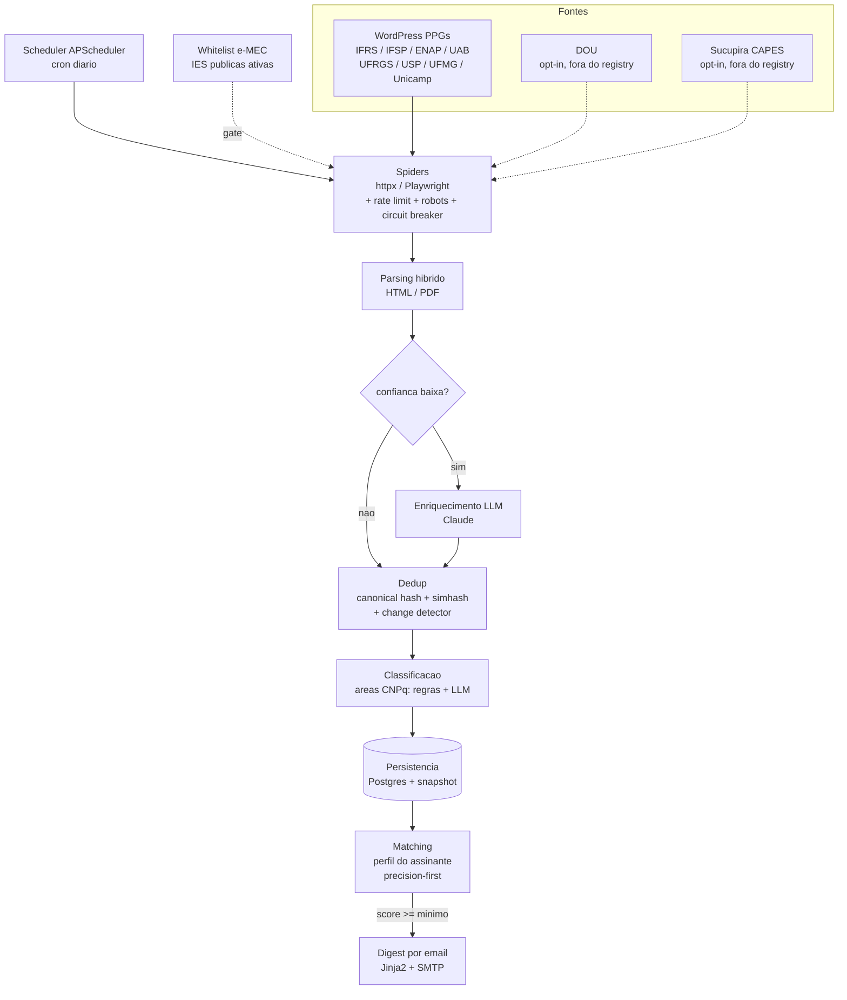

# pos-editais-monitor

Monitor automatizado de editais de pos-graduacao **gratuitos** no Brasil. Descobre, normaliza, deduplica, classifica e filtra chamadas (especializacao, MBA, mestrado, doutorado, EAD/UAB) espalhadas por centenas de portais e entrega um **digest diario por email** apenas quando ha matches contra o perfil do assinante.

[](https://github.com/fabricioguidine/pos-editais-monitor/actions/workflows/ci.yml) [](LICENSE) [](https://www.python.org) [](docker/)

A informacao existe, mas esta fragmentada, muitas vezes apenas em PDF e sem feed RSS. Este projeto e um pipeline de ingestao multi-fonte com parsing hibrido (regras + fallback LLM) e notificacao precision-first: preferimos perder um edital marginal a entregar dezenas de emails irrelevantes por semana.

## Funcionalidades

- **Descoberta multi-fonte** via spiders por portal (WordPress de PPGs, UAB, IFs, universidades), com clientes httpx e Playwright.
- **Parsing hibrido** HTML/PDF com estrategias por tipo de fonte e fallback LLM (Claude) quando a confianca extraida e baixa.
- **Deduplicacao** por hash canonico, simhash e change detector entre snapshots.
- **Classificacao** por areas CNPq combinando regras e LLM.
- **Whitelist e-MEC** como gate: so processa editais de IES publicas ativas e credenciadas.
- **Matching precision-first** baseado no perfil do assinante (hard filters + soft scoring).
- **Digest diario por email** (Jinja2 + SMTP), com canal Telegram opcional.
- **API FastAPI** para consulta de editais e healthcheck.
- **CLI `pem`** para scrape ad-hoc, worker, seed, refresh da whitelist e dispatch manual do digest.
- **Observabilidade** com logs estruturados (structlog), traces OpenTelemetry e metricas Prometheus.

## Arquitetura

Pipeline ingestao -> parse -> dedup/classify -> persist -> match -> digest, organizado em camadas (Clean Architecture / Hexagonal).



Detalhamento de cada camada, fluxos de dados e decisoes de projeto em [`docs/ARCHITECTURE.md`](docs/ARCHITECTURE.md) e [`docs/adr/`](docs/adr/).

## Fontes monitoradas

A **whitelist de IES** vem do cadastro oficial [e-MEC](https://emec.mec.gov.br): o pipeline nao processa edital de instituicao que nao esteja ativa, credenciada e categorizada como publica/gratuita. A whitelist e cacheada por 7 dias, com refresh forcado via `pem refresh-emec`.

Spiders ativos no registry (`SPIDER_REGISTRY`):

| Spider        | Fonte             | Mecanismo       |
|---------------|-------------------|-----------------|
| `ifrs`        | IFRS              | httpx + RSS/BS4 |
| `ifsp`        | IFSP              | httpx + RSS/BS4 |
| `enap`        | ENAP              | httpx + RSS/BS4 |
| `uab`         | UAB (EAD publica) | httpx + RSS/BS4 |
| `ufrgs-inf`   | UFRGS Informatica | httpx + RSS/BS4 |
| `usp-ime`     | USP IME           | httpx + RSS/BS4 |
| `ufmg-dcc`    | UFMG DCC          | httpx + RSS/BS4 |
| `unicamp-ime` | Unicamp IME       | httpx + RSS/BS4 |

**DOU (Imprensa Nacional)** e **Sucupira CAPES** estao codificados porem fora do registry ativo (`robots.txt` com `Disallow: /`), disponiveis para uso futuro com flag opt-in. Estrategia detalhada em [`docs/SOURCES.md`](docs/SOURCES.md) e [`docs/SCRAPING_STRATEGY.md`](docs/SCRAPING_STRATEGY.md).

### Postura de scraping

Monitora apenas sites publicos de instituicoes publicas, com postura conservadora e auditavel: `robots.txt` respeitado por padrao, User-Agent identificavel, rate limit por host (`PEM_RATE_LIMIT_RPS`), cache de respostas em Redis, backoff exponencial e circuit breaker. Sem rotacao de proxies, stealth fingerprinting ou CAPTCHA solver. Playwright so para paginas JS-heavy; estaticas vao por httpx. Detalhes em [`docs/SCRAPING_STRATEGY.md`](docs/SCRAPING_STRATEGY.md) e [ADR-0005](docs/adr/0005-respectful-scraping.md).

## Matching personalizado

Cada subscriber tem um perfil que descreve o que aceita receber. O `MatchEngine` aplica **hard filters** eliminatorios (gratuidade, IES na whitelist e-MEC publica, nivel aceito, modalidade aceita) seguidos de **soft scoring** por area CNPq: match exato soma `peso`; match `cross_discipline` valido soma `peso` se `requer_aceita_cs` for satisfeito. So entra no digest quando `score >= score_minimo`.

O perfil padrao (`pem seed`) e configurado para especializacao e MBA:

```yaml
profile:
  nome: fabricio
  formacao: bacharelado_ciencia_computacao
  areas_alvo:
    - codigo_cnpq: "10300007"        # Ciencia da Computacao
      modo: exact
      peso: 1.0
    - codigo_cnpq: "10700001"        # area cross-discipline
      modo: cross_discipline
      requer_aceita_cs: true         # so conta se edital aceitar CS
      peso: 0.7
  niveis_aceitos: [especializacao, mba]
  apenas_gratuitos: true
  apenas_ies_emec_publicas: true
  score_minimo: 0.70
```

## Requisitos

- Python 3.11+
- Docker + Docker Compose
- (opcional) [uv](https://github.com/astral-sh/uv) para gerenciar o venv mais rapido

## Instalacao e execucao

```bash
git clone https://github.com/fabricioguidine/pos-editais-monitor
cd pos-editais-monitor
cp .env.example .env
# edite .env: ANTHROPIC_API_KEY, credenciais SMTP (App Password do Gmail), etc.

make dev              # cria venv, instala deps, playwright e pre-commit
make compose-up       # sobe Postgres + Redis + smtp4dev (docker/docker-compose.yml)
make migrate          # aplica migrations (alembic upgrade head)
make run-api          # API em http://localhost:8000 (swagger em /docs)
```

Em outro terminal:

```bash
make run-worker       # scheduler + pipeline async (loop)
```

### Docker

O `docker/docker-compose.yml` sobe Postgres, Redis, um SMTP mock (`smtp4dev`, web UI em `http://localhost:5000`) e os servicos `api` (porta 8000) e `worker` (metricas em 9090), ambos buildados de `docker/Dockerfile` (multi-stage, base Playwright, usuario nao-root).

### CLI `pem`

```bash
pem seed                  # subscriber default + fontes basicas no DB
pem scrape --source ifrs  # roda um spider ad-hoc (ex: ifrs, uab, usp-ime)
pem refresh-emec          # forca refresh da whitelist e-MEC
pem dispatch-digest       # envia o digest do dia agora (nao espera o cron)
pem worker                # sobe o worker (bloqueante)
pem version
```

### Testes

```bash
make test-unit            # rapido, sem rede, sem DB
make test-integration     # exige Postgres e Redis up (docker compose)
make test-contracts       # bate em fontes reais (CI roda nightly, nao em PR)
```

## Configuracao

Toda configuracao e feita por variaveis de ambiente (pydantic-settings, prefixo `PEM_`). Copie `.env.example` para `.env` e ajuste. Principais chaves:

- `PEM_DATABASE_URL` — string de conexao asyncpg do Postgres.
- `PEM_REDIS_URL` — conexao Redis (cache/queue).
- `ANTHROPIC_API_KEY` — habilita o fallback/enriquecimento LLM (Claude).
- credenciais SMTP — envio do digest por email (App Password do Gmail).
- `PEM_RATE_LIMIT_RPS` — rate limit por host do scraping.
- `PEM_PROMETHEUS_PORT` — porta do endpoint de metricas.

Logs estruturados via `structlog` (JSON em prod, console em dev), traces OpenTelemetry (FastAPI, httpx, SQLAlchemy) e metricas Prometheus (`pem_spider_requests_total`, `pem_pipeline_items_processed_total`, `pem_matches_total`, `pem_notifications_sent_total`, entre outras).

## Estrutura do projeto

```
src/pos_editais_monitor/
├── domain/            # entidades, value objects, enums (sem deps externas)
├── infrastructure/    # adaptadores: db, redis, storage, llm, emec, smtp
├── scraping/          # spiders, clients http/playwright, middlewares (rate, robots, CB)
├── parsers/           # strategy: html, pdf, wordpress + registry + fallback LLM
├── pipeline/          # orchestrator async + dead letter queue
├── dedup/             # canonical hash, simhash, change detector
├── classification/    # areas CNPq: regras + LLM
├── matching/          # perfil do assinante + score engine (precision-first)
├── notifications/     # dispatcher + canais email/telegram + templates Jinja2
├── scheduling/        # jobs APScheduler (cron diario)
├── api/               # FastAPI app + routers + schemas + dependencies
├── core/              # config, logging, observabilidade (OTEL/metrics)
└── cli/               # CLI typer (pem)
```

## Licenca

MIT. Veja [LICENSE](LICENSE).
